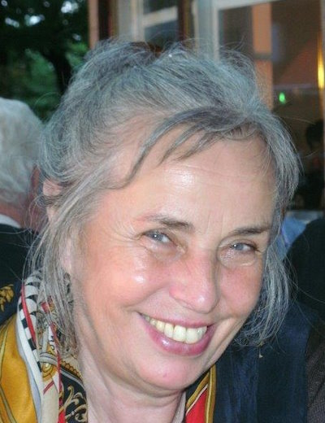
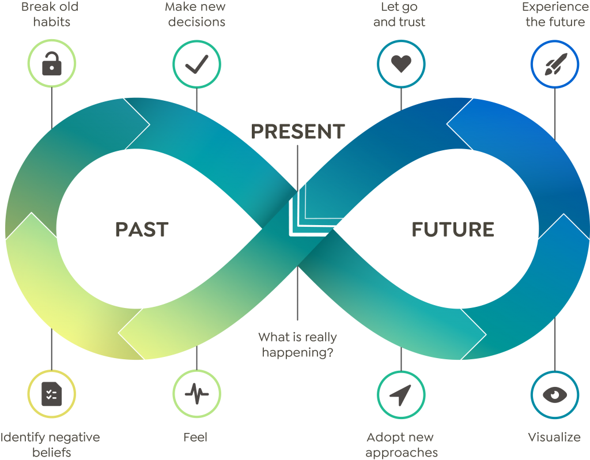

# Aus Alt mach Neu ... durch ... Coaching

* Wer nicht loslässt, hat keinen Platz für Neues

* alte Glaubenssätze auflösen, eintauchen, durchtauchen,  entspannen, loslassen,  ein Gefühl ist nur ein Gefühl, Verantwortung übernehmen  und ins Handeln kommen ,

* Das Leben ist schön, in Achtsamkeit beobachten, präsent im Hier und Jetzt

* wer willst du sein?  Wie willst du sein? Neue Entscheidungen treffen, glücklich werden und sein.

* sein und werden, sei du selbst, räum auf in dir und Hindernisse aus dem Weg.

__Ich bin zertifizierter Greator Choach nach der Methode der liegenden Acht.__

[]

Schenk dir eine Stunde Selbstliebe. Was ist jetzt wirklich los?

Meine Stationen sind:

* gewaltfreie Kommunikation
* Mediation
* Weg der Liebe
* Jahrestraining in Achtsamkeit

Auf den Punkt gebracht, geht es darum, sich selbst zu erkennen, mit Körper Geist und Seele, dein Potenzial sehen wie du sein könntest und dich daran zu erinnern, damit du ein glückliches, zufriedenes und selbstbestimmtes Leben führst.

* Wenn du magst, begleite ich dich gerne.

Glück ist eine Entscheidung!

Kontakt: Wilhelmine.Voigt@web.de
